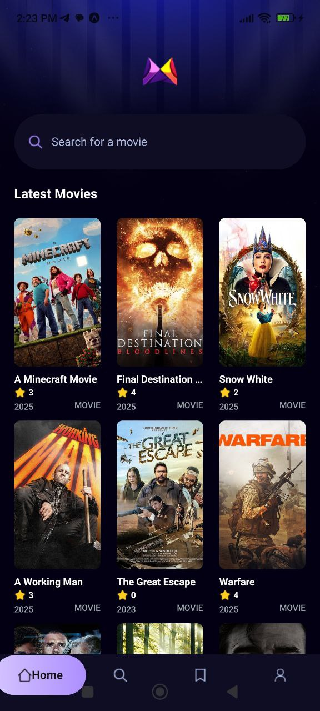
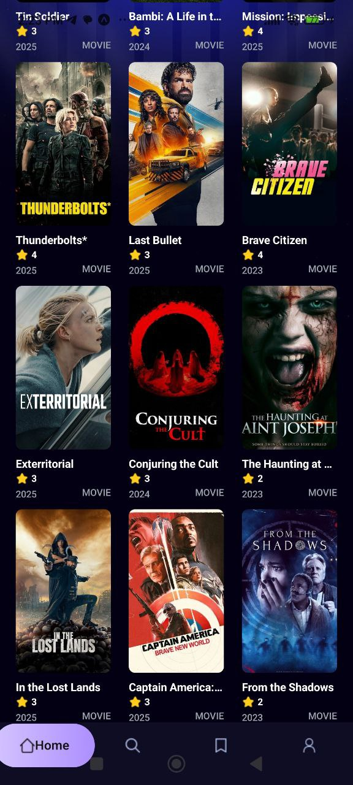
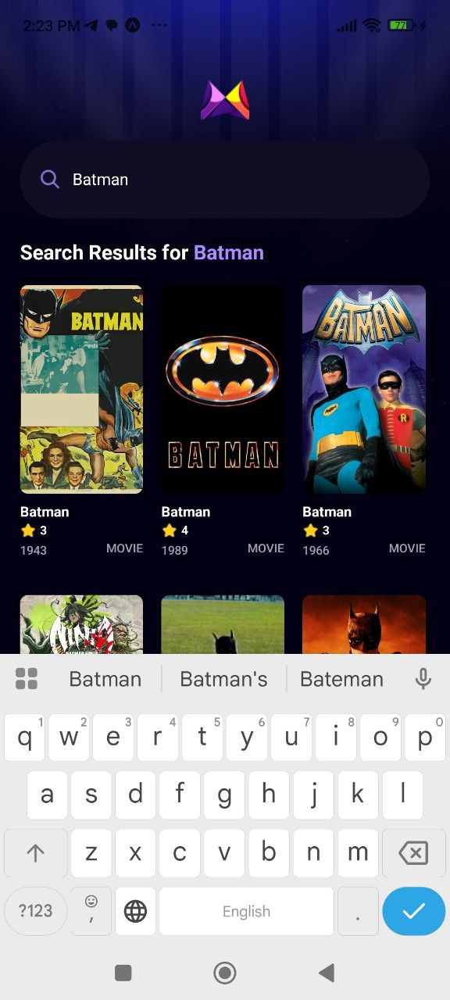

# 🎬 React Native Movie App (with Expo)

Get hands-on with **React Native** and **Expo** in this beginner-friendly crash course!  
This project walks you through building a beautiful and functional **mobile movie app** from scratch while learning the essential skills for cross-platform mobile development.

## 🚀 What You'll Learn

- Setting up a React Native project using **Expo**
- Navigating screens with **React Navigation**
- Fetching data from a movie API
- Creating custom UI components
- Styling with Flexbox and StyleSheet
- Handling asynchronous operations and state

## 📱 Screenshots

<p float="left">
  
  
  
  
</p>

## 🛠 Tech Stack

- [React Native](https://reactnative.dev/)
- [Expo](https://expo.dev/)
- [React Navigation](https://reactnavigation.org/)
- [The Movie Database (TMDb) API](https://developer.themoviedb.org/docs)

## 📦 Installation

1. Clone the repo:

```bash
git clone https://github.com/your-username/react-native-movie-app.git
cd react-native-movie-app
